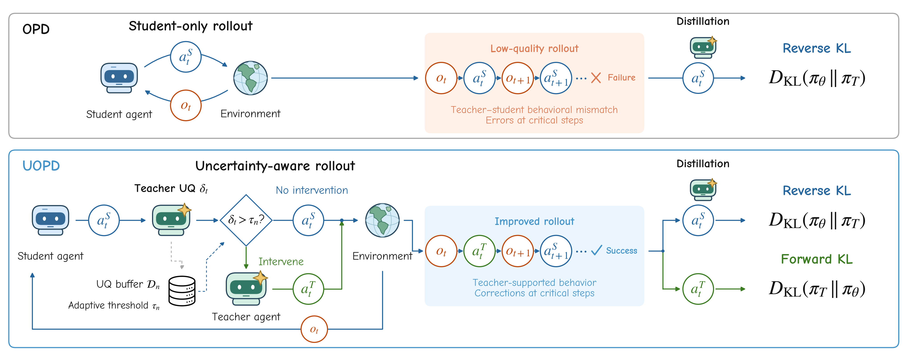

<p align="center">
  <h1 align="center">UOPD: Uncertainty-Aware Intervention for<br>On-Policy Distillation of Multi-Turn Agents</h1>
</p>

<p align="center">
  <a href="https://huggingface.co/collections/Wenboz/uopd-6ab8534f122ef418c3d7595e" target="_blank"></a>
  
  
</p>

Official implementation of **UOPD**, an on-policy distillation method that uses
teacher uncertainty to decide when a teacher should correct a student during a
multi-turn rollout.

<p align="center">
  
</p>

## 🔥 News

* [2026-09] Released the UOPD code, and trained checkpoints.

## Overview

In a multi-turn environment, one poor student action can change every observation
and decision that follows. Standard on-policy distillation (OPD) can reduce the
probability of that sampled action, but the action is still executed during rollout
collection and OPD does not directly provide an alternative action.

UOPD lets the student propose every action and asks a frozen teacher to evaluate
its uncertainty on that action. It then uses two forms of supervision:

- At a **low-uncertainty turn**, execute the student action and apply the standard
  OPD loss.
- At a **high-uncertainty turn**, sample and execute a teacher action, then train
  the student to imitate it with supervised fine-tuning.

The intervention changes both the learning target and the next environment state.
An adaptive threshold follows a scheduled intervention rate, concentrating a
limited teacher budget on uncertain decisions throughout training.

## Key Results

UOPD improves both task performance and interaction efficiency across the two
agent environments released here. Results below are means over evaluation seeds
42, 43, and 44; each row evaluates one trained checkpoint.

| Student | Method | ALFWorld seen SR | ALFWorld unseen SR | WebShop score | WebShop SR | WebShop turns |
|---|---|---:|---:|---:|---:|---:|
| Qwen2.5-3B | OPD | 88.1 | 85.3 | 77.5 | 66.9 | 7.4 |
| Qwen2.5-3B | **UOPD** | **90.0** | **88.8** | **82.4** | **69.3** | **6.5** |
| Qwen2.5-1.5B | OPD | 86.2 | 84.8 | 66.3 | 52.3 | 7.9 |
| Qwen2.5-1.5B | **UOPD** | **89.8** | **86.6** | **76.8** | **58.6** | **6.8** |

Success rates and WebShop scores are percentages; lower turns are better. The
paper reports the complete comparison with all baselines and standard deviations.

## What Is Included

This release contains the code and configurations for the **ALFWorld and WebShop
experiments in Table 1**. It intentionally excludes analysis scripts, intermediate
experiments, unrelated environments, and methods outside that table.

| Method | Config name | Rollout and supervision |
|---|---|---|
| OPD | `opd` | Student rollout with teacher token-level supervision |
| TCOD-F2B | `tcod_f2b` | Progressively extend a student rollout from the initial state |
| TCOD-B2F | `tcod_b2f` | Replay a shrinking offline teacher prefix, then run the student |
| FTB-OPD | `ftb_opd` | Validate teacher corrections using paired student continuations |
| UOPD | `uopd` | Select and execute teacher corrections using uncertainty |

## Repository Layout

```text
UOPD/
├── configs/
│   ├── alfworld/{1.5b,3b}/     # Five Table 1 methods per student size
│   └── webshop/{1.5b,3b}/
├── data/
│   ├── manifests/              # Task identities and offline teacher actions
│   └── README.md               # Data provenance and expert collection
├── environments/              # ALFWorld and WebShop setup
├── scripts/                    # Data, training, and evaluation entry points
└── trinity/
    ├── algorithm/              # OPD advantage and UOPD mixed loss
    ├── common/workflows/envs/UOPD/
    └── trainer/verl/           # FSDP training backend
```

## Installation

The experiments use Python 3.10, PyTorch 2.8, vLLM 0.10.2, and verl 0.7.
Create a dedicated environment because this repository provides its own modified
`trinity` package.

```bash
conda create -n uopd python=3.10 -y
conda activate uopd
python -m pip install 'pip<25' 'setuptools==69.5.1' 'wheel==0.43.0'
python -m pip install -c environments/constraints.txt \
  'numpy==1.26.4' 'Cython<3.1' pybind11 cmake ninja packaging
python -m pip install --no-build-isolation \
  -c environments/constraints.txt -e '.[vllm,environments,dev]'
python -m pip install flash-attn==2.8.3 --no-build-isolation
```

CUDA-compatible drivers and a CUDA toolkit are required for GPU training. The
constraints file records the main versions used in our experiments; it is not a
complete operating-system image.

## Environment and Data Setup

### ALFWorld

```bash
export ALFWORLD_DATA="$HOME/.cache/alfworld"
alfworld-download
python scripts/prepare_data.py --env alfworld --alfworld-root "$ALFWORLD_DATA"
```

This materializes portable game paths for 3,553 training tasks, 140 seen test
tasks, and 134 unseen test tasks.

### WebShop

```bash
conda install -c conda-forge openjdk=11 -y
export JAVA_HOME="$CONDA_PREFIX"
export JVM_PATH="$JAVA_HOME/lib/server/libjvm.so"
export LD_LIBRARY_PATH="$JAVA_HOME/lib/server:${LD_LIBRARY_PATH:-}"
export WEBSHOP_ROOT="$PWD/third_party/WebShop"

bash environments/setup_webshop.sh
python scripts/prepare_data.py --env webshop
```

The setup uses the 1,000-product WebShop catalog and its matching Lucene index.
The released manifests contain 6,410 training tasks and a fixed 128-task test set.
See [environment setup](environments/README.md) for the simulator details and
[data documentation](data/README.md) for task ordering, teacher actions, and
optional expert recollection.

## Quick Start

Run commands from the repository root. Training uses one 8-GPU node: four GPUs
for student rollout, two for the teacher, and two for FSDP training.

```bash
export PYTHONPATH="$PWD:${WEBSHOP_ROOT:-}:${PYTHONPATH:-}"
export VLLM_ENABLE_V1_MULTIPROCESSING=0
export TOKENIZERS_PARALLELISM=false

ray start --head --num-gpus=8

uopd train \
  --env webshop \
  --size 3b \
  --method uopd \
  --output /your/shared/storage/webshop-3b-uopd
```

Valid values are:

- `--env`: `alfworld`, `webshop`
- `--size`: `1.5b`, `3b`
- `--method`: `opd`, `tcod_f2b`, `tcod_b2f`, `ftb_opd`, `uopd`

For Slurm, adjust the resource header in `scripts/train.slurm` for your cluster:

```bash
sbatch scripts/train.slurm webshop 3b uopd /your/shared/storage/webshop-3b-uopd
```

The example requests an exclusive 8-GPU node and does not select a specific host.

## Evaluation

```bash
ray start --head --num-gpus=1

# Trained checkpoint
uopd eval \
  --env alfworld \
  --model "<your model path>" \
  --output "<your output path>"

# Zero-shot student
uopd eval \
  --env webshop \
  --model Qwen/Qwen2.5-1.5B-Instruct \
  --output "<your output path>"

# RL teacher
uopd eval \
  --env webshop \
  --model langfeng01/GiGPO-Qwen2.5-7B-Instruct-WebShop \
  --output "<your output path>"
```

The command writes one directory per seed and a final `summary.json`. ALFWorld
reports seen and unseen success rates and mean turns separately. WebShop reports
mean task score, success rate, and mean turns. The summarizer verifies that every
expected task appears exactly once before aggregating the three seeds.

## Acknowledgements

The runtime is derived from [Trinity-RFT](https://github.com/agentscope-ai/Trinity-RFT)
and uses [verl](https://github.com/volcengine/verl) and
[vLLM](https://github.com/vllm-project/vllm). The release includes implementations
of [TCOD](https://github.com/kokolerk/TCOD) and
[FutureBridge-OPD](https://github.com/ChenChiShui/FutureBridge-OPD) for comparison.
See [NOTICE](NOTICE) and [LICENSE](LICENSE) for attribution.

## Citation

The arXiv link and BibTeX entry will be added when the paper record is public.
